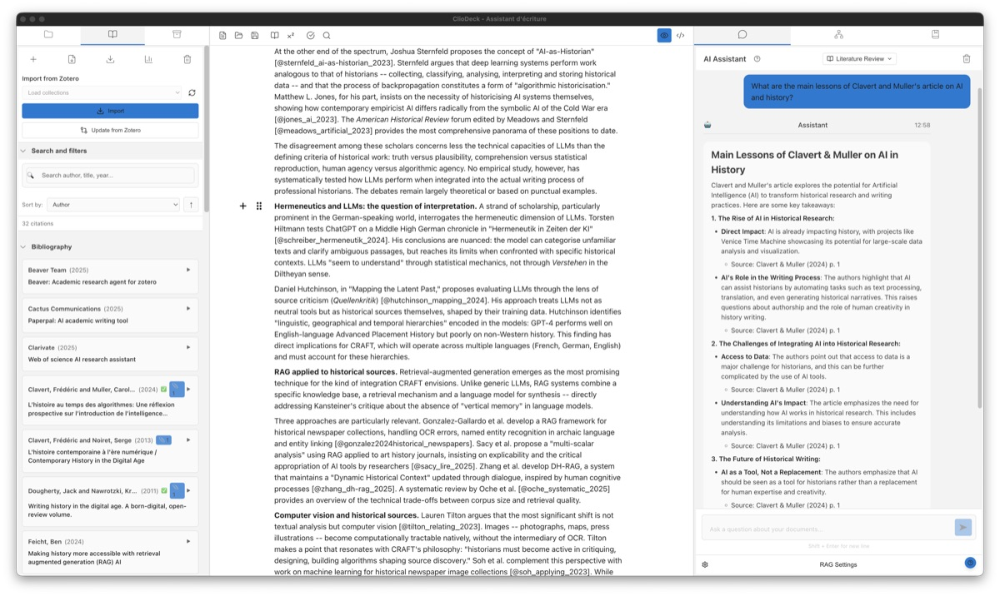
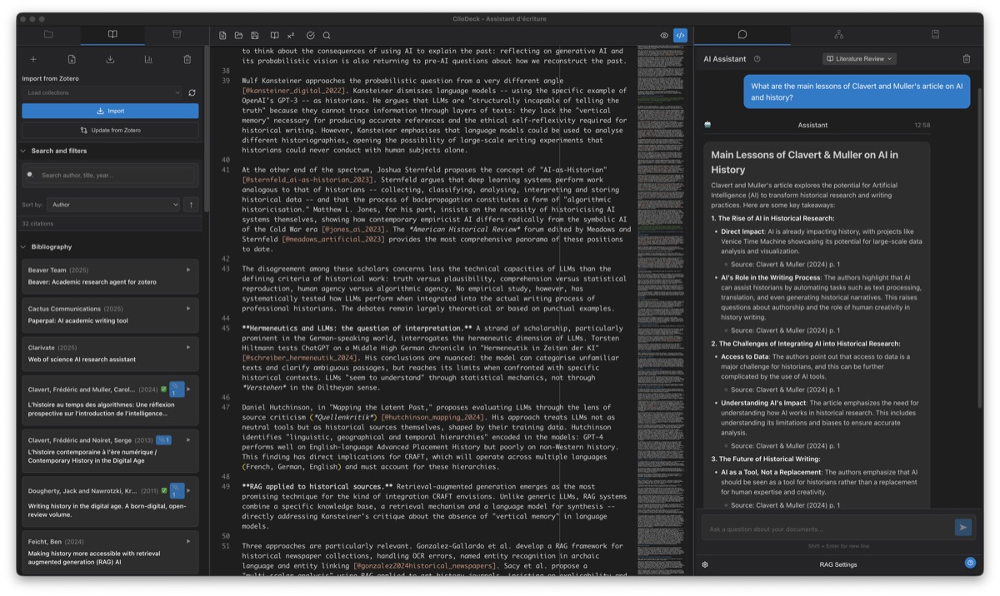

ClioDeck is a local-first, AI-powered writing assistant designed for historians and humanities researchers. It combines RAG-based research, bibliography management, primary source analysis, and document editing in a single desktop application.

ClioDeck is a [vibe-coding](https://en.wikipedia.org/wiki/Vibe_coding) experiment by [Frédéric Clavert](https://inactinique.github.io), coded with [Claude Code](https://docs.anthropic.com/en/docs/claude-code).

ClioDeck est un assistant d'écriture local, propulsé par l'IA, conçu pour les historiens et les chercheurs en sciences humaines. Il combine recherche par RAG, gestion bibliographique, analyse de sources primaires et édition de documents dans une seule application de bureau.

ClioDeck est une expérience de [vibe-coding](https://en.wikipedia.org/wiki/Vibe_coding) par [Frédéric Clavert](https://inactinique.github.io), codée avec [Claude Code](https://docs.anthropic.com/en/docs/claude-code).

<h2>FeaturesFonctionnalités</h2>

<ul class="features-list">

<li>
<strong>RAG Research AssistantAssistant de recherche RAG</strong>
Query your PDFs and sources in natural language. Every answer includes automatic source citations.
Interrogez vos PDF et vos sources en langage naturel. Chaque réponse inclut des citations automatiques des sources.
</li>

<li>
<strong>Bibliography ManagementGestion bibliographique</strong>
Zotero synchronization, BibTeX import/export, PDF indexing, and a statistics dashboard for your library.
Synchronisation Zotero, import/export BibTeX, indexation de PDF et tableau de bord statistique pour votre bibliothèque.
</li>

<li>
<strong>Primary SourcesSources primaires</strong>
Tropy integration with OCR and transcription support. Search across both secondary and primary sources simultaneously.
Intégration Tropy avec OCR et support de transcription. Recherchez simultanément dans vos sources secondaires et primaires.
</li>

<li>
<strong>Corpus AnalysisAnalyse de corpus</strong>
Knowledge graph visualization, textometrics (word frequencies, n-grams, TF-IDF), similarity finder, and optional topic modeling.
Visualisation de graphe de connaissances, textométrie (fréquences de mots, n-grammes, TF-IDF), recherche de similarités et modélisation de thèmes optionnelle.
</li>

<li>
<strong>Document EditorÉditeur de documents</strong>
WYSIWYG Markdown editor with citation autocomplete. Export to PDF (via LaTeX) or Word (.docx).
Éditeur Markdown WYSIWYG avec auto-complétion des citations. Export en PDF (via LaTeX) ou Word (.docx).
</li>

<li>
<strong>Research JournalJournal de recherche</strong>
Session tracking, chat history, and activity timeline to keep track of your research process.
Suivi des sessions, historique des conversations et chronologie d'activité pour suivre votre processus de recherche.
</li>

</ul>

<h2>Design PhilosophyPrincipes de conception</h2>

- **Local-first** — All your data stays on your machine
- **Open source** — Licensed under GPLv3
- **Works offline** — Embedded LLM for use without internet
- **macOS & Linux** — Desktop application built with Electron
- **Academic transparency** — Every AI answer is traceable to its sources

- **Local d'abord** — Toutes vos données restent sur votre machine
- **Open source** — Sous licence GPLv3
- **Fonctionne hors ligne** — LLM embarqué pour une utilisation sans internet
- **macOS & Linux** — Application de bureau construite avec Electron
- **Transparence académique** — Chaque réponse de l'IA est traçable jusqu'à ses sources

<h2>Get StartedCommencer</h2>

ClioDeck is available on [GitHub](https://github.com/inactinique/cliodeck). You'll find the documentation on the project's [wiki](https://github.com/inactinique/cliodeck/wiki).

ClioDeck est disponible sur [GitHub](https://github.com/inactinique/cliodeck). Vous trouverez la documentation sur le [wiki](https://github.com/inactinique/cliodeck/wiki) du projet.

