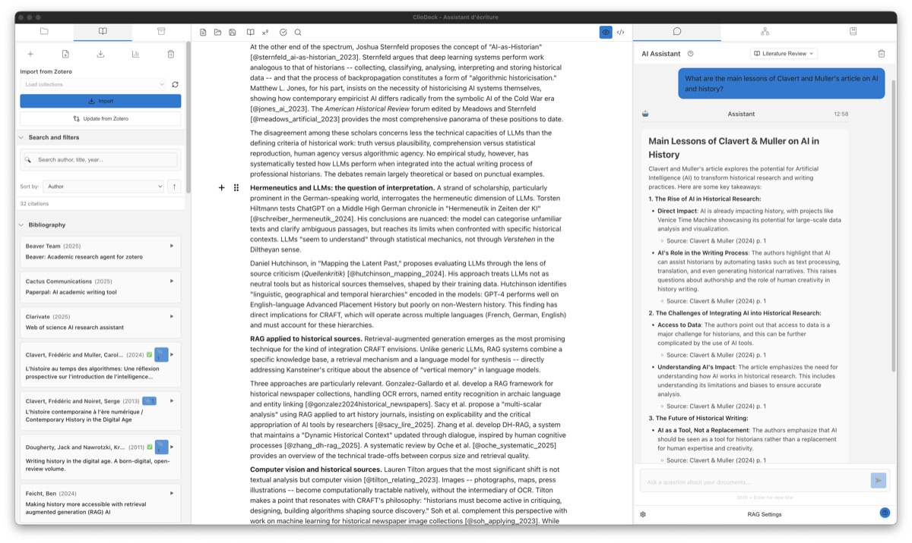
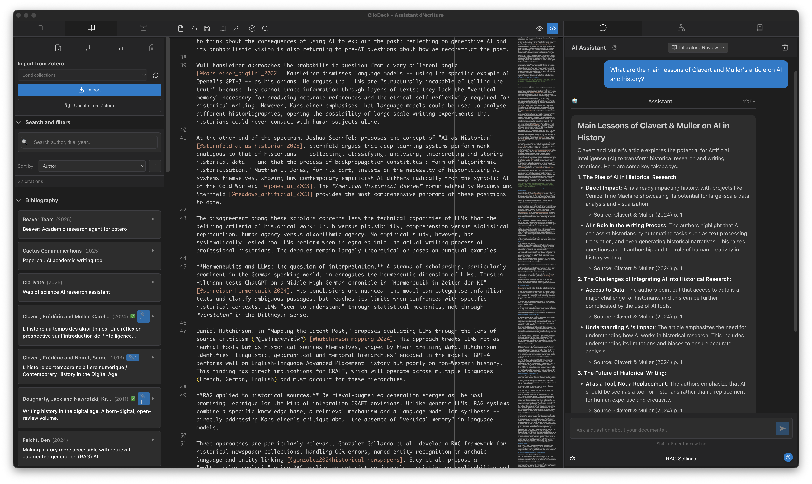

ClioDeck is a local-first, AI-powered writing assistant designed for historians and humanities researchers. It combines RAG-based research, bibliography management, primary source analysis, and document editing in a single desktop application.

ClioDeck is a [vibe-coding](https://en.wikipedia.org/wiki/Vibe_coding) experiment by [Frédéric Clavert](https://inactinique.github.io), coded with [Claude Code](https://docs.anthropic.com/en/docs/claude-code).

ClioDeck est un assistant d'écriture local, propulsé par l'IA, conçu pour les historiens et les chercheurs en sciences humaines. Il combine recherche par RAG, gestion bibliographique, analyse de sources primaires et édition de documents dans une seule application de bureau.

ClioDeck est une expérience de [vibe-coding](https://en.wikipedia.org/wiki/Vibe_coding) par [Frédéric Clavert](https://inactinique.github.io), codée avec [Claude Code](https://docs.anthropic.com/en/docs/claude-code).

<h2 id="features">FeaturesFonctionnalités</h2>

<ul class="features-list">

<li>
<strong>RAG Research AssistantAssistant de recherche RAG</strong>
Query your PDFs and sources in natural language. Every answer includes automatic source citations.
Interrogez vos PDF et vos sources en langage naturel. Chaque réponse inclut des citations automatiques des sources.
</li>

<li>
<strong>Brainstorm ModeMode Brainstorm</strong>
A dedicated chat mode for the exploratory phase of research: agent loop with tool-use, retrieval grounding across PDFs, Tropy archives, Obsidian notes and your own manuscript, and per-project context (<code>context.md</code>).
Un mode chat dédié à la phase exploratoire de la recherche : boucle agent avec outils, ancrage RAG sur PDF, archives Tropy, notes Obsidian et votre propre manuscrit, et contexte par projet (<code>context.md</code>).
</li>

<li>
<strong>MCP IntegrationIntégration MCP</strong>
ClioDeck is both an MCP client (consume third-party MCP servers from Brainstorm) and an MCP server (expose your indexed corpus to Claude Desktop or Claude Code). Inactive by default, audited via a JSONL access log, and third-party tool results are inspected before they reach the model.
ClioDeck est à la fois client MCP (consomme des serveurs MCP tiers depuis Brainstorm) et serveur MCP (expose votre corpus indexé à Claude Desktop ou Claude Code). Inactif par défaut, journal d'accès JSONL, et les résultats d'outils tiers sont inspectés avant d'atteindre le modèle.
</li>

<li>
<strong>Archive ConnectorsConnecteurs d'archives</strong>
Search Gallica (BnF), HAL (CCSD) and Europeana directly from Brainstorm or any connected MCP client. API keys (Europeana only) are stored via Electron <code>safeStorage</code>, never in plain text.
Cherchez dans Gallica (BnF), HAL (CCSD) et Europeana directement depuis Brainstorm ou un client MCP connecté. Les clés API (Europeana uniquement) sont stockées via Electron <code>safeStorage</code>, jamais en clair.
</li>

<li>
<strong>Bibliography ManagementGestion bibliographique</strong>
Zotero synchronization, BibTeX import/export, PDF indexing, and a statistics dashboard for your library.
Synchronisation Zotero, import/export BibTeX, indexation de PDF et tableau de bord statistique pour votre bibliothèque.
</li>

<li>
<strong>Primary SourcesSources primaires</strong>
Tropy integration with OCR and transcription support, in batch or one source at a time. Search across both secondary and primary sources simultaneously, filtered by collection if you wish.
Intégration Tropy avec OCR et support de transcription, par lot ou source par source. Recherchez simultanément dans vos sources secondaires et primaires, filtrées par collection si vous le souhaitez.
</li>

<li>
<strong>Your Own Manuscript as a CorpusVotre manuscrit comme corpus</strong>
What you have written is indexed alongside your sources, so you can ask what you said about a subject three chapters ago. Excerpts from your own draft are always labelled apart from your sources — you must be able to see when you are citing yourself. Settings show the index state and let you rebuild it.
Ce que vous avez écrit est indexé aux côtés de vos sources : de quoi retrouver ce que vous disiez d'un sujet trois chapitres plus tôt. Les extraits de votre brouillon sont toujours distingués de vos sources — vous devez pouvoir voir quand vous vous citez vous-même. Les réglages affichent l'état de l'index et permettent de le reconstruire.
</li>

<li>
<strong>Corpus AnalysisAnalyse de corpus</strong>
Knowledge graph visualization, textometrics (word frequencies, n-grams, TF-IDF), similarity finder, and optional topic modeling.
Visualisation de graphe de connaissances, textométrie (fréquences de mots, n-grammes, TF-IDF), recherche de similarités et modélisation de thèmes optionnelle.
</li>

<li>
<strong>Document EditorÉditeur de documents</strong>
Live-render Markdown editor (CodeMirror 6) with footnotes, Pandoc citations and citation autocomplete. Articles, books and presentations all share the same editor. Export to PDF (via LaTeX), Word (.docx) or reveal.js slides.
Éditeur Markdown en rendu live (CodeMirror 6) avec notes de bas de page, citations Pandoc et auto-complétion des citations. Articles, livres et présentations partagent le même éditeur. Export en PDF (via LaTeX), Word (.docx) ou diaporama reveal.js.
</li>

<li>
<strong>Research JournalJournal de recherche</strong>
Session tracking, chat history, and activity timeline to keep track of your research process. It can be purged, behind a confirmation that names exactly what disappears.
Suivi des sessions, historique des conversations et chronologie d'activité pour suivre votre processus de recherche. Il peut être purgé, derrière une confirmation qui nomme précisément ce qui disparaît.
</li>

<li>
<strong>AI Usage JournalJournal d'usage de l'IA</strong>
A reflexive record of your own recourse to AI: volumes, tasks and corpora, plus a manual decision layer — what non-AI alternative existed, why it was set aside, whether it was worth it. Kept in a separate database and <strong>never records your prompts</strong>.
Un relevé réflexif de votre propre recours à l'IA : volumes, tâches et corpus, plus une couche décisionnelle manuelle — quelle alternative non-IA existait, pourquoi elle a été écartée, si cela en valait la peine. Conservé dans une base séparée et <strong>n'enregistre jamais vos prompts</strong>.
</li>

</ul>

<h2>Design PhilosophyPrincipes de conception</h2>

- **Local-first** — All your data stays on your machine
- **Your files stay yours** — Plain Markdown, byte-for-byte fidelity, readable and versionable outside ClioDeck
- **Open source** — Licensed under GPLv3
- **Works offline** — Embedded LLM for use without internet
- **macOS & Linux** — Desktop application built with Electron; a Windows build exists and should work, but is untested
- **Academic transparency** — Every AI answer is traceable to its sources, and every AI edit is an explicit decision you made

- **Local d'abord** — Toutes vos données restent sur votre machine
- **Vos fichiers restent les vôtres** — Markdown brut, fidélité octet pour octet, lisible et versionnable hors de ClioDeck
- **Open source** — Sous licence GPLv3
- **Fonctionne hors ligne** — LLM embarqué pour une utilisation sans internet
- **macOS & Linux** — Application de bureau construite avec Electron ; une version Windows existe et devrait fonctionner, mais n'est pas testée
- **Transparence académique** — Chaque réponse de l'IA est traçable jusqu'à ses sources, et chaque modification par l'IA est une décision que vous avez prise

<h2>Get StartedCommencer</h2>

ClioDeck is available on [GitHub](https://github.com/cliodeck/cliodeck-app). You'll find the documentation on the project's [wiki](https://github.com/cliodeck/cliodeck-app/wiki).

**Before you download.** ClioDeck 1.0.0-rc.4 is a *release candidate*: usable for real work, but still under active testing. Two things are worth knowing:

- The application is **not code-signed**. macOS Gatekeeper will refuse to open it on first launch (right-click → Open to bypass), and managed university machines may block it outright.
- Installation is still **technical**. A local model server ([Ollama](https://ollama.com)) is needed unless you use a cloud provider with your own API key, and PDF export requires [Pandoc](https://pandoc.org) plus a LaTeX distribution. The [wiki](https://github.com/cliodeck/cliodeck-app/wiki) walks through it.

ClioDeck est disponible sur [GitHub](https://github.com/cliodeck/cliodeck-app). Vous trouverez la documentation sur le [wiki](https://github.com/cliodeck/cliodeck-app/wiki) du projet.

**Avant de télécharger.** ClioDeck 1.0.0-rc.4 est un *candidat de version* : utilisable pour un vrai travail, mais encore en cours de test. Deux choses méritent d'être sues :

- L'application **n'est pas signée**. Gatekeeper refusera de l'ouvrir au premier lancement sous macOS (clic droit → Ouvrir pour passer outre), et les machines universitaires administrées peuvent la bloquer entièrement.
- L'installation reste **technique**. Un serveur de modèles local ([Ollama](https://ollama.com)) est nécessaire, sauf à utiliser un fournisseur distant avec votre propre clé d'API, et l'export PDF demande [Pandoc](https://pandoc.org) et une distribution LaTeX. Le [wiki](https://github.com/cliodeck/cliodeck-app/wiki) détaille la marche à suivre.

<h2 id="contact">ContactContact</h2>

Bugs and feature requests belong in the [issue tracker](https://github.com/cliodeck/cliodeck-app/issues), where they stay visible and get followed up. For anything else — a question, a use I hadn't anticipated, an academic collaboration — write to infos (at) cliodeck.app.

Les bugs et demandes de fonctionnalités ont leur place dans le [suivi des tickets](https://github.com/cliodeck/cliodeck-app/issues), où ils restent visibles et suivis. Pour tout le reste — une question, un usage que je n'avais pas prévu, une collaboration académique — écrivez à infos (at) cliodeck.app.

<h2 id="whats-new">What's new in 1.0.0-rc.4Nouveautés de la 1.0.0-rc.4</h2>

Where the previous candidate added things, this one makes sure the existing ones tell you the truth. Three audits — security, robustness, interface — were run over everything rc.3 changed, and their findings fixed. Almost none of what they found crashed: it produced **wrong results without saying so**.

Là où le précédent candidat ajoutait, celui-ci s'assure que l'existant dit vrai. Trois audits — sécurité, robustesse, interface — ont passé en revue tout ce que la rc.3 avait changé, et leurs constats ont été corrigés. Presque rien de ce qu'ils ont trouvé ne plantait : cela **produisait un résultat faux, sans le dire**.

<ul class="features-list">

<li>
<strong>Your exported book is whole againVotre livre exporté est de nouveau entier</strong>
Two defects silently removed text from an exported manuscript. A footnote placed inside an HTML block — a boxed aside, say — lost its text on export and printed <code>[^1]</code> instead. And every PDF title page was corrupted as soon as a name contained an ampersand: <em>Dupont &amp; Fils</em> printed as <em>Dupont \textbackslash&amp; Fils</em>, which made an abstract unreadable from its first ampersand. Two book export routes that failed outright now work.
Deux défauts retiraient du texte d'un manuscrit exporté, sans le dire. Une note de bas de page placée dans un bloc HTML — un encadré, par exemple — perdait son texte à l'export et imprimait <code>[^1]</code> à la place. Et toute page de titre PDF était corrompue dès qu'un nom contenait une esperluette : <em>Dupont &amp; Fils</em> s'imprimait <em>Dupont \textbackslash&amp; Fils</em>, ce qui rendait un résumé illisible dès la première occurrence. Deux chemins d'export de livre qui échouaient franchement fonctionnent.
</li>

<li>
<strong>What you are shown is the source's own textCe qu'on vous montre est bien le texte de la source</strong>
The panel listing the excerpts an answer relies on had stopped showing them faithfully. Tables were shredded and recomposed into rows that had never existed; sentences taken from far apart were joined with no ellipsis, reading as a continuous quotation found nowhere in the document. For a discipline whose method is the quotation, that is not a cosmetic defect. Tables and code now pass through whole, cuts are marked, and the order of the text is preserved.
Le panneau qui liste les extraits sur lesquels une réponse s'appuie avait cessé de les montrer fidèlement. Des tableaux étaient pulvérisés puis recomposés en lignes qui n'avaient jamais existé ; des phrases prélevées loin les unes des autres étaient collées sans marque de coupe, donnant à lire une citation continue introuvable dans le document. Pour une discipline dont la méthode est la citation, ce n'est pas un défaut cosmétique. Les tableaux et le code passent désormais entiers, les coupes sont signalées, et l'ordre du texte est préservé.
</li>

<li>
<strong>Nothing is lost when you leaveRien ne se perd quand vous quittez</strong>
Quitting the application just after typing lost what you had written: the editor was never asked to save. A chapter could also disappear for good from the manuscript index, because its fingerprint was written before its content — so every later pass skipped it as unchanged. And renumbering footnotes during an export could rewrite the manuscript underneath it.
Quitter l'application juste après avoir tapé perdait ce que vous veniez d'écrire : on ne demandait jamais à l'éditeur d'enregistrer. Un chapitre pouvait aussi disparaître définitivement de l'index du manuscrit, son empreinte étant écrite avant son contenu — les passes suivantes le sautaient comme « inchangé ». Et renuméroter les notes pendant un export pouvait réécrire le manuscrit sous celui-ci.
</li>

<li>
<strong>Settings that existed only in a fileDes réglages qui n'existaient que dans un fichier</strong>
Several features shipped without the controls that would let you reach them. Book settings — footnotes or endnotes, numbering, one bibliography or one per chapter — could only be changed by hand-editing a JSON file, which nothing told you was possible; they now have a dialog, and they drive the Word export as well as the PDF one. Your manuscript, indexed as a fourth corpus since rc.3, never actually reached the assistant and had no interface at all: both are fixed. The research journal can be purged, primary sources can be re-OCR'd one at a time, and the embedded embeddings model has a control at last.
Plusieurs fonctions étaient livrées sans les commandes permettant de les atteindre. Les réglages d'ouvrage — notes de bas de page ou de fin, numérotation, bibliographie unique ou par chapitre — ne se changeaient qu'en éditant un fichier JSON à la main, ce que rien n'indiquait ; ils ont maintenant une fenêtre de réglages, et pilotent l'export Word autant que le PDF. Votre manuscrit, indexé comme quatrième corpus depuis la rc.3, n'atteignait en réalité jamais l'assistant et n'avait aucune interface : les deux sont corrigés. Le journal de recherche peut être purgé, une source primaire peut être repassée à l'OCR seule, et le modèle d'embeddings embarqué a enfin un réglage.
</li>

<li>
<strong>In your language, everywhereDans votre langue, partout</strong>
The interface is now fully translatable into French, English and German. The previous check compared the three translation files with each other, so it could not see a phrase missing from all three — which is how an entire dialog stayed English in every language. One case is worth naming: the insertion templates write into <em>your manuscript</em>, not into the interface, so a German speaker found French words inside their own document.
L'interface est désormais entièrement traduisible en français, anglais et allemand. Le contrôle précédent comparait les trois fichiers de traduction entre eux : il ne pouvait donc pas voir une phrase absente des trois — c'est ainsi qu'une fenêtre entière est restée en anglais dans toutes les langues. Un cas mérite d'être nommé : les gabarits d'insertion écrivent dans <em>votre manuscrit</em>, pas dans l'interface, si bien qu'un germanophone trouvait des mots français à l'intérieur de son propre document.
</li>

<li>
<strong>Sharing a project is saferPartager un projet est plus sûr</strong>
A ClioDeck project travels as a folder, and a folder can come from someone else. Opening one used to start whatever helper programs its configuration declared, without asking; it now asks, and remembers your answer. The context file at the root of a project — which is handed to the assistant with high authority — is now inspected like any other outside content. And a link clicked inside an assistant reply can no longer navigate the window out of the application.
Un projet ClioDeck voyage comme un dossier, et un dossier peut venir de quelqu'un d'autre. En ouvrir un lançait jusqu'ici les programmes auxiliaires déclarés dans sa configuration, sans rien demander ; il vous le demande désormais, et retient votre réponse. Le fichier de contexte à la racine d'un projet — remis à l'assistant avec une autorité élevée — est maintenant inspecté comme tout contenu extérieur. Et un lien cliqué dans une réponse de l'assistant ne peut plus faire sortir la fenêtre de l'application.
</li>

</ul>

Some caveats worth knowing: the Word export now follows the book settings for chapter numbering and structure, but the choice between footnotes and endnotes remains PDF-only — it relies on typesetting commands a `.docx` cannot express. A per-chapter bibliography needs a bibliography file and gives way to a single one when you let ClioDeck format citations itself. The application is also still unsigned, and a dependency carries a published vulnerability that is [not reachable in this code](https://github.com/cliodeck/cliodeck-app/issues/77) — updating it means rewriting how PDFs are read, which was not a sensible thing to do in a release candidate. The [full release notes](https://github.com/cliodeck/cliodeck-app/wiki/3.4-RC4-Release-Notes) list everything.

Quelques réserves à connaître : l'export Word suit désormais les réglages d'ouvrage pour la numérotation et la structure des chapitres, mais le choix entre notes de bas de page et notes de fin reste propre au PDF — il repose sur des commandes de composition qu'un `.docx` ne sait pas exprimer. Une bibliographie par chapitre suppose un fichier bibliographique et cède la place à une bibliographie unique si vous laissez ClioDeck formater lui-même les citations. L'application n'est toujours pas signée, et une dépendance porte une faille publiée qui [n'est pas atteignable dans ce code](https://github.com/cliodeck/cliodeck-app/issues/77) — la mettre à jour suppose de réécrire la lecture des PDF, ce qu'il n'était pas raisonnable de faire dans un candidat de version. Les [notes de version complètes](https://github.com/cliodeck/cliodeck-app/wiki/3.4-RC4-Release-Notes) détaillent le reste.

