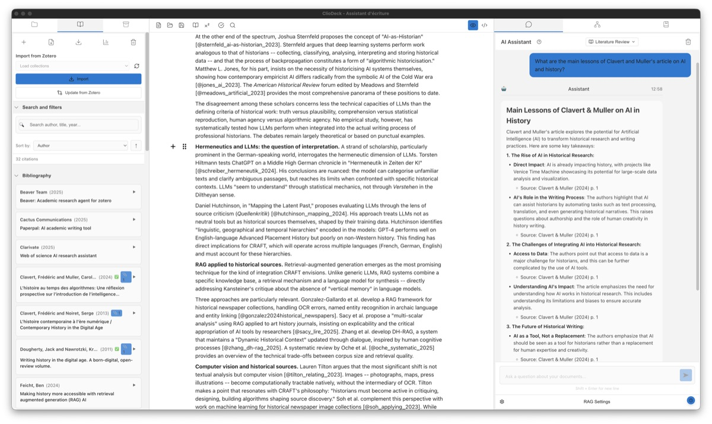
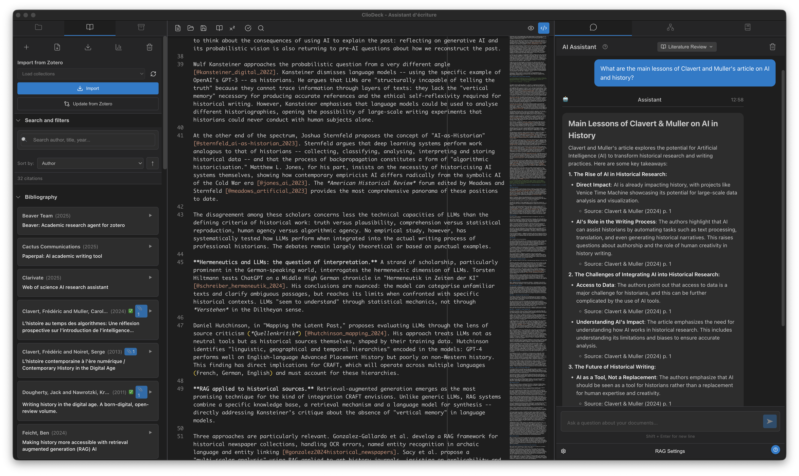

ClioDeck is a local-first, AI-powered writing assistant designed for historians and humanities researchers. It combines RAG-based research, bibliography management, primary source analysis, and document editing in a single desktop application.

ClioDeck is a [vibe-coding](https://en.wikipedia.org/wiki/Vibe_coding) experiment by [Frédéric Clavert](https://inactinique.github.io), coded with [Claude Code](https://docs.anthropic.com/en/docs/claude-code).

ClioDeck est un assistant d'écriture local, propulsé par l'IA, conçu pour les historiens et les chercheurs en sciences humaines. Il combine recherche par RAG, gestion bibliographique, analyse de sources primaires et édition de documents dans une seule application de bureau.

ClioDeck est une expérience de [vibe-coding](https://en.wikipedia.org/wiki/Vibe_coding) par [Frédéric Clavert](https://inactinique.github.io), codée avec [Claude Code](https://docs.anthropic.com/en/docs/claude-code).

<h2 id="features">FeaturesFonctionnalités</h2>

<ul class="features-list">

<li>
<strong>RAG Research AssistantAssistant de recherche RAG</strong>
Query your PDFs and sources in natural language. Every answer includes automatic source citations.
Interrogez vos PDF et vos sources en langage naturel. Chaque réponse inclut des citations automatiques des sources.
</li>

<li>
<strong>Brainstorm ModeMode Brainstorm</strong>
A dedicated chat mode for the exploratory phase of research: agent loop with tool-use, retrieval grounding across PDFs, Tropy archives, Obsidian notes and your own manuscript, and per-project context (<code>context.md</code>).
Un mode chat dédié à la phase exploratoire de la recherche : boucle agent avec outils, ancrage RAG sur PDF, archives Tropy, notes Obsidian et votre propre manuscrit, et contexte par projet (<code>context.md</code>).
</li>

<li>
<strong>MCP IntegrationIntégration MCP</strong>
ClioDeck is both an MCP client (consume third-party MCP servers from Brainstorm) and an MCP server (expose your indexed corpus to Claude Desktop or Claude Code). Inactive by default, audited via a JSONL access log, and third-party tool results are inspected before they reach the model.
ClioDeck est à la fois client MCP (consomme des serveurs MCP tiers depuis Brainstorm) et serveur MCP (expose votre corpus indexé à Claude Desktop ou Claude Code). Inactif par défaut, journal d'accès JSONL, et les résultats d'outils tiers sont inspectés avant d'atteindre le modèle.
</li>

<li>
<strong>Archive ConnectorsConnecteurs d'archives</strong>
Search Gallica (BnF), HAL (CCSD) and Europeana directly from Brainstorm or any connected MCP client. API keys (Europeana only) are stored via Electron <code>safeStorage</code>, never in plain text.
Cherchez dans Gallica (BnF), HAL (CCSD) et Europeana directement depuis Brainstorm ou un client MCP connecté. Les clés API (Europeana uniquement) sont stockées via Electron <code>safeStorage</code>, jamais en clair.
</li>

<li>
<strong>Bibliography ManagementGestion bibliographique</strong>
Zotero synchronization, BibTeX import/export, PDF indexing, and a statistics dashboard for your library.
Synchronisation Zotero, import/export BibTeX, indexation de PDF et tableau de bord statistique pour votre bibliothèque.
</li>

<li>
<strong>Primary SourcesSources primaires</strong>
Tropy integration with OCR and transcription support, in batch or one source at a time. Search across both secondary and primary sources simultaneously, filtered by collection if you wish.
Intégration Tropy avec OCR et support de transcription, par lot ou source par source. Recherchez simultanément dans vos sources secondaires et primaires, filtrées par collection si vous le souhaitez.
</li>

<li>
<strong>Your Own Manuscript as a CorpusVotre manuscrit comme corpus</strong>
What you have written is indexed alongside your sources, so you can ask what you said about a subject three chapters ago. Excerpts from your own draft are always labelled apart from your sources — you must be able to see when you are citing yourself. Settings show the index state and let you rebuild it.
Ce que vous avez écrit est indexé aux côtés de vos sources : de quoi retrouver ce que vous disiez d'un sujet trois chapitres plus tôt. Les extraits de votre brouillon sont toujours distingués de vos sources — vous devez pouvoir voir quand vous vous citez vous-même. Les réglages affichent l'état de l'index et permettent de le reconstruire.
</li>

<li>
<strong>Corpus AnalysisAnalyse de corpus</strong>
Knowledge graph visualization, textometrics (word frequencies, n-grams, TF-IDF), similarity finder, and optional topic modeling.
Visualisation de graphe de connaissances, textométrie (fréquences de mots, n-grammes, TF-IDF), recherche de similarités et modélisation de thèmes optionnelle.
</li>

<li>
<strong>Document EditorÉditeur de documents</strong>
Live-render Markdown editor (CodeMirror 6) with footnotes, Pandoc citations and citation autocomplete. Articles, books and presentations all share the same editor. Export to PDF (via LaTeX), Word (.docx) or reveal.js slides.
Éditeur Markdown en rendu live (CodeMirror 6) avec notes de bas de page, citations Pandoc et auto-complétion des citations. Articles, livres et présentations partagent le même éditeur. Export en PDF (via LaTeX), Word (.docx) ou diaporama reveal.js.
</li>

<li>
<strong>Research JournalJournal de recherche</strong>
Session tracking, chat history, and activity timeline to keep track of your research process. It can be purged, behind a confirmation that names exactly what disappears.
Suivi des sessions, historique des conversations et chronologie d'activité pour suivre votre processus de recherche. Il peut être purgé, derrière une confirmation qui nomme précisément ce qui disparaît.
</li>

<li>
<strong>AI Usage JournalJournal d'usage de l'IA</strong>
A reflexive record of your own recourse to AI: volumes, tasks and corpora, plus a manual decision layer — what non-AI alternative existed, why it was set aside, whether it was worth it. Kept in a separate database and <strong>never records your prompts</strong>.
Un relevé réflexif de votre propre recours à l'IA : volumes, tâches et corpus, plus une couche décisionnelle manuelle — quelle alternative non-IA existait, pourquoi elle a été écartée, si cela en valait la peine. Conservé dans une base séparée et <strong>n'enregistre jamais vos prompts</strong>.
</li>

</ul>

<h2>Design PhilosophyPrincipes de conception</h2>

- **Local-first** — All your data stays on your machine
- **Your files stay yours** — Plain Markdown, byte-for-byte fidelity, readable and versionable outside ClioDeck
- **Open source** — Licensed under GPLv3
- **Works offline** — Embedded LLM for use without internet
- **macOS & Linux** — Desktop application built with Electron; a Windows build exists and should work, but is untested
- **Academic transparency** — Every AI answer is traceable to its sources, and every AI edit is an explicit decision you made

- **Local d'abord** — Toutes vos données restent sur votre machine
- **Vos fichiers restent les vôtres** — Markdown brut, fidélité octet pour octet, lisible et versionnable hors de ClioDeck
- **Open source** — Sous licence GPLv3
- **Fonctionne hors ligne** — LLM embarqué pour une utilisation sans internet
- **macOS & Linux** — Application de bureau construite avec Electron ; une version Windows existe et devrait fonctionner, mais n'est pas testée
- **Transparence académique** — Chaque réponse de l'IA est traçable jusqu'à ses sources, et chaque modification par l'IA est une décision que vous avez prise

<h2>Get StartedCommencer</h2>

ClioDeck is available on [GitHub](https://github.com/cliodeck/cliodeck-app). You'll find the documentation on the project's [wiki](https://github.com/cliodeck/cliodeck-app/wiki).

**Before you download.** ClioDeck 1.0.0-rc.5 is a *release candidate*: usable for real work, but still under active testing. Two things are worth knowing:

- The application is now code-signed for macOS! Gatekeeper will open it and ask you if you wish to open it on first launch.
- Installation is still **technical**. A local model server ([Ollama](https://ollama.com)) is needed unless you use a cloud provider with your own API key, and PDF export requires [Pandoc](https://pandoc.org) plus a LaTeX distribution. The [wiki](https://github.com/cliodeck/cliodeck-app/wiki) walks through it.

ClioDeck est disponible sur [GitHub](https://github.com/cliodeck/cliodeck-app). Vous trouverez la documentation sur le [wiki](https://github.com/cliodeck/cliodeck-app/wiki) du projet.

**Avant de télécharger.** ClioDeck 1.0.0-rc.5 est un *candidat de version* : utilisable pour un vrai travail, mais encore en cours de test. Deux choses méritent d'être sues :

- L'application est désormais signée sur macOS. Gatekeeper demandera si vous souhaitez l'ouvrir, mais ne l'empêchera pas.
- L'installation reste **technique**. Un serveur de modèles local ([Ollama](https://ollama.com)) est nécessaire, sauf à utiliser un fournisseur distant avec votre propre clé d'API, et l'export PDF demande [Pandoc](https://pandoc.org) et une distribution LaTeX. Le [wiki](https://github.com/cliodeck/cliodeck-app/wiki) détaille la marche à suivre.

<h2 id="contact">ContactContact</h2>

Bugs and feature requests belong in the [issue tracker](https://github.com/cliodeck/cliodeck-app/issues), where they stay visible and get followed up. For anything else — a question, a use I hadn't anticipated, an academic collaboration — write to infos (at) cliodeck.app.

Les bugs et demandes de fonctionnalités ont leur place dans le [suivi des tickets](https://github.com/cliodeck/cliodeck-app/issues), où ils restent visibles et suivis. Pour tout le reste — une question, un usage que je n'avais pas prévu, une collaboration académique — écrivez à infos (at) cliodeck.app.

